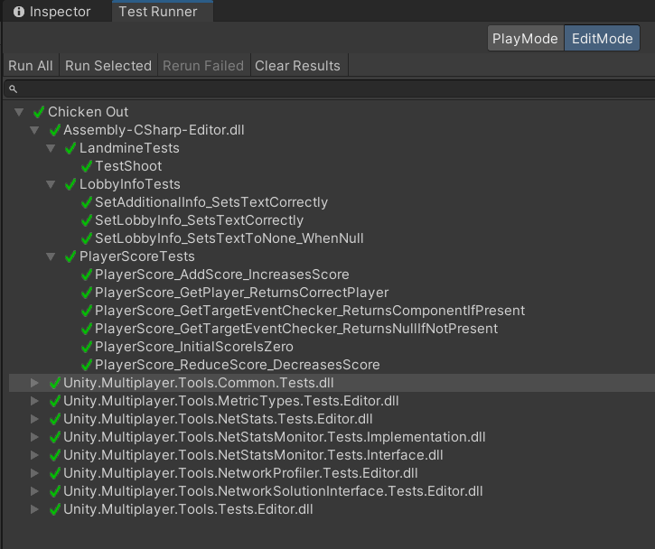

# Project Documentation
## Table of Contents
1. [Quality Attributes](#quality-attributes)
2. [Logging](#logging)
3. [Creation of Objects](#creation-of-objects)
4. [Persistence](#persistence)
5. [Error Handling](#error-handling)
6. [Continous Integration](#continous-integration)
7. [Testing](#testing)

## Quality Attributes
### Performance
The game is designed to run efficiently on a range of devices. Performance optimizations include efficient network communication using Unity's Netcode and minimizing unnecessary calculations in the game loop.

### Scalability
The architecture supports scalability by using NetworkVariables and ClientRpc/ServerRpc calls to handle multiple players efficiently. This allows for smooth gameplay even as the number of players increases. The NetworkManagerTemp and LobbyManager scripts handle network hosting and client connections, ensuring scalability in multiplayer environments.

### Maintainability
The codebase is modular, with separate scripts handling different functionalities (e.g., PlayerInput, PlayerMovement, Health, MapLoader, NetworkManagerTemp, LobbyManager). This modularity makes the code easier to maintain and extend.

### Usability
The game controls are designed to be intuitive, using Unity's Input System for handling player inputs. The system supports both keyboard/mouse and gamepad controls, enhancing user experience. Additionally, the MapLoader script provides functionality to dynamically load different maps, keeping the game experience fresh and engaging.

### Reliability
Network communication is handled robustly, with proper synchronization of game states across clients and the server. Error handling mechanisms ensure that the game can recover gracefully from network disruptions. The MapLoader, NetworkManagerTemp, and LobbyManager scripts ensure reliable scene loading and network connections.

### Security
Network communications are secured using Unity's Netcode for GameObjects, which ensures that only authorized clients can join the game sessions and interact with the game world. The LobbyManager handles authentication and lobby management, adding an additional layer of security.

## Logging
### Implementation
Logging is implemented using Unity's built-in logging functionalities (Debug.Log, Debug.LogWarning, Debug.LogError). Important events such as player actions, network status changes, map loading, lobby management, and error occurrences are logged.

### Benefits
- Debugging: Helps in identifying and fixing bugs during development and post-release.
- Monitoring: Allows developers to monitor game performance and identify potential issues in real-time.
- Audit Trail: Provides a record of events that can be useful for analyzing player behavior and improving game features.

## Creation of Objects
### Players
Player objects are instantiated and managed by the NetworkManager. Each player is assigned a unique identifier using the IDHolder script, which ensures proper synchronization across the network.

### Weapons
Weapons are managed by the WeaponHolder script. Players can pick up, use, and drop weapons, with their state synchronized using NetworkVariables.

### Game Environment
Static game objects (e.g., terrain, obstacles) are created using Unity's editor. Dynamic objects (e.g., projectiles, power-ups) are instantiated during gameplay as needed. The MapLoader script dynamically loads different scenes, ensuring variety in the game environment.

### Network Management
The NetworkManagerTemp script manages the creation and connection of network sessions. It handles the initialization of the host and clients, setting up relay servers, and managing network events. The LobbyManager script manages lobby creation, joining, and maintenance, ensuring a smooth multiplayer experience.

## Persistence

The network state is maintained by Unity's Netcode for GameObjects, which ensures that all clients have a consistent view of the game world.

## Error Handling
### Implementation
Error handling is implemented using try-catch blocks where necessary. Network-related errors are handled by Unity's Netcode for GameObjects, ensuring that the game can recover from disconnections and other network issues. The MapLoader, NetworkManagerTemp, and LobbyManager scripts include error handling to manage situations where a map file is not found or network issues occur.

### User Feedback
Errors that impact the user experience are communicated to the player through UI elements, such as error messages or notifications.

### Recovery Mechanisms
The game includes mechanisms to gracefully handle errors, such as retrying failed network requests or providing fallback options when an error occurs.

## Continous Integration

The executable of the game gets build automatically with every push to the GitHub Repository using GitHub Actions.

## Testing

The Testing is done with the Unity Test Framework. This implements a Testrunner in the Unity Editor through which the Unit Tests can be run. Sadly i could not get them to run with a GitHub action.

